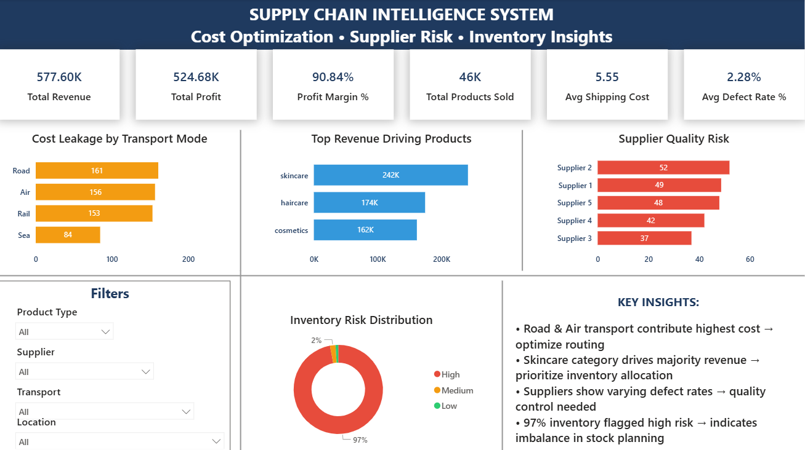

# 🚀 Supply Chain Intelligence System

## 📌 Overview
This project is an end-to-end **Supply Chain Analytics Solution** designed to identify:
- Cost inefficiencies  
- Supplier risks  
- Inventory imbalances  
- Revenue drivers  

The goal is to enable **data-driven decision making** for optimizing supply chain operations.

---

## 🎯 Business Problem
Organizations often lack visibility into:
- Where costs are increasing  
- Which suppliers impact quality  
- Which products drive revenue  
- Where inventory risks exist  

This leads to poor operational decisions and increased costs.

---

## 💡 Solution
Built a complete analytics pipeline using:
- **Python** → Data cleaning & feature engineering  
- **SQL** → Business analysis & KPI extraction  
- **Power BI** → Interactive dashboard for decision-making  

---

## 🛠️ Tech Stack
- Python (Pandas, NumPy, Matplotlib, Seaborn)  
- SQL (MySQL)  
- Power BI  

---

## 📊 Key Features
- KPI tracking (Revenue, Profit, Margin, Cost)  
- Cost leakage analysis by transport mode  
- Supplier quality risk analysis  
- Inventory risk classification  
- Interactive filtering (Product, Supplier, Transport, Location)  

---

## 📈 Key Insights
- Road & Air transport contribute highest logistics cost → optimization opportunity  
- Skincare category drives majority revenue → prioritize inventory allocation  
- Suppliers show varying defect rates → quality control needed  
- 97% inventory flagged as high risk → imbalance in stock planning  

---

## 🏗️ Project Structure

supply-chain-intelligence/
│
├── data/
│ ├── raw/
│ ├── processed/
│
├── notebooks/
│ └── eda_feature_engineering.ipynb
│
├── sql/
│ └── Analysis.sql
│
├── dashboard/
│ └── Supply_Chain_Intelligence.pbix
│
├── images/
│ └── dashboard_preview.png
│
├── README.md

---

## 📷 Dashboard Preview

---

## ⚙️ How to Run

### 1. Python
- Run notebook to clean and process data  
- Output → cleaned dataset  

### 2. SQL
- Execute `final_analysis.sql`  
- Generate KPIs and insights  

### 3. Power BI
- Open `.pbix` file  
- Interact with dashboard  

---

## 🚀 Business Impact
- Identified cost optimization opportunities  
- Enabled supplier performance monitoring  
- Highlighted inventory risks  
- Provided a centralized decision-making dashboard  

---

## 📌 Future Improvements
- Demand forecasting using ML  
- Real-time data integration  
- Automated pipeline  

---

## 🙌 Author
Deepak Kumar Khadka